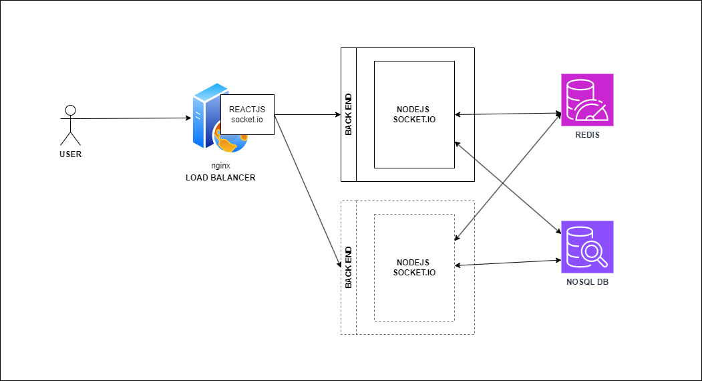
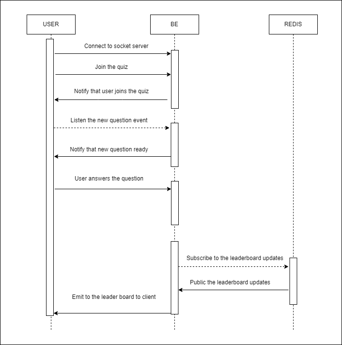

# Real-Time Vocabulary Quiz Coding Challenge
## Overview
Welcome to the Real-Time Quiz coding challenge! Your task is to create a technical solution for a real-time quiz feature for an English learning application. This feature will allow users to answer questions in real-time, compete with others, and see their scores updated live on a leaderboard.


## Architecture Diagram


## Component Description
1.Client (ReactJS + Socket.IO Client):
- The client interacts with the backend using WebSocket (via socket.io).

2.Web Server (NGINX):

- Acts as a load balancer for the backend Node.js instances.
- It distributes the traffic between multiple Node.js instances to handle scale.
- It also forwards WebSocket connections (sticky sessions might be required).

3.Backend (Node.js + Socket.IO + Redis):

- Each Node.js instance runs a socket.io server for real-time communication.
- Redis is used as the pub/sub system for socket events, allowing for horizontal scaling (synchronizing between different Node.js instances).
- The backend will also interface with the NoSQL database.

4.Redis:

- Redis functions as the message broker between backend instances, allowing for seamless communication across different Node.js servers.
- It handles the pub/sub messaging pattern for socket.io, ensuring that WebSocket events are synchronized even when clients connect to different backend servers.
- This enables horizontal scaling as new Node.js instances can be added to handle more connections without losing event synchronization.

5.Database (NoSQL):

- NoSQL database for storing application data.
- Could be MongoDB or Redis (as a primary database).
- The backend Node.js application communicates with the NoSQL database to handle data persistence.

### Horizontal Scaling Made Easy:

- Horizontal scaling is achieved by allowing multiple Node.js instances to handle WebSocket connections, with Redis ensuring that all instances are synchronized in real-time.
- As traffic increases, more backend Node.js instances can be added behind the NGINX load balancer, and Redis will ensure consistency across all instances.
- This architecture allows the system to efficiently manage large numbers of WebSocket connections, handle real-time communication, and scale up as needed.


## Data Flow


## Technologies and Tools
- FE : ReactJS + Vite + Socket client
- Webserver : nginx
- BE : Node.js + Socket.IO + Redis
- Message broker : Redis
- Tools : Docker

## Set up src
- Requirement : Docker
- Install
```
## Build and run docker 
## /quiz-app
- docker-compose build
- docker-compose up -d

## Explode the project on http://localhost:3000
```

## Todo list
- Save the question and quiz data to the database
- App can handle multiple session by the quizId